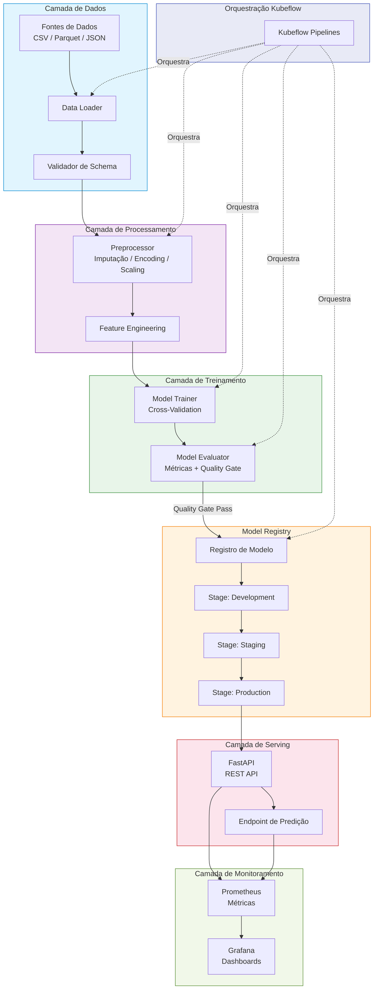
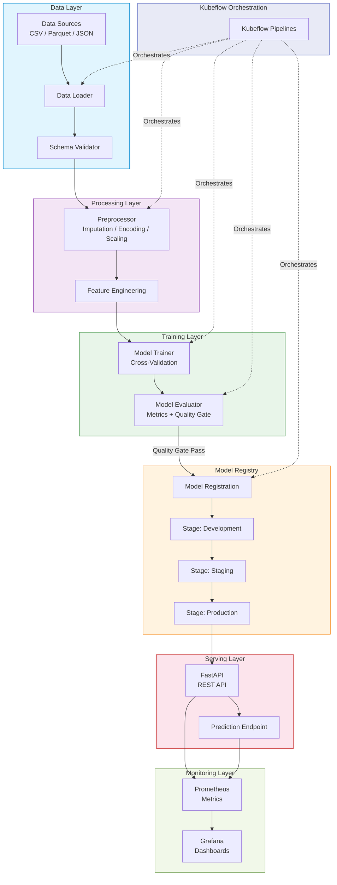

<div align="center">

# ml-platform-kubeflow-orchestrator

Plataforma de orquestração de pipelines de Machine Learning com Kubeflow Pipelines, experiment tracking via MLflow e model registry integrado para deploy automatizado em produção.

[](https://python.org)
[](https://www.kubeflow.org/)
[](https://mlflow.org)
[](https://fastapi.tiangolo.com)
[](https://postgresql.org)
[](https://docker.com)
[](https://kubernetes.io)
[](LICENSE)
[](Dockerfile)

[Português](#português) | [English](#english)

</div>

---

## Português

### Sobre

Esta plataforma foi projetada para resolver um dos maiores desafios em organizações que trabalham com Machine Learning: a lacuna entre experimentação e produção. Enquanto cientistas de dados conseguem treinar modelos localmente com relativa facilidade, o caminho até um serviço confiável em produção geralmente envolve semanas de trabalho manual e propenso a erros.

O **ML Platform Kubeflow Orchestrator** automatiza todo o ciclo de vida de modelos ML — desde a ingestão de dados até o deploy em produção — utilizando Kubeflow Pipelines como engine de orquestração. A plataforma implementa quality gates configuráveis que garantem que apenas modelos que atendem critérios mínimos de qualidade sejam promovidos, eliminando deploys acidentais de modelos degradados.

O sistema inclui um model registry com gerenciamento de estágios (development → staging → production → archived), promoção automática champion-challenger, rollback instantâneo, e uma API REST completa para integração com sistemas externos. A observabilidade é garantida via métricas Prometheus e dashboards Grafana pré-configurados.

### Tecnologias

| Tecnologia | Versão | Uso |
|---|---|---|
| Python | 3.11+ | Linguagem principal |
| Kubeflow Pipelines | 2.x | Orquestração de pipelines ML |
| MLflow | 2.x | Experiment tracking e model registry |
| FastAPI | 0.109+ | API REST para gerenciamento da plataforma |
| PostgreSQL | 15 | Armazenamento de metadados |
| Prometheus | 2.50+ | Coleta de métricas |
| Grafana | 10.3+ | Visualização e dashboards |
| Docker | 24+ | Containerização |
| Kubernetes | 1.28+ | Orquestração de containers |
| scikit-learn | 1.4+ | Framework de ML |
| GitHub Actions | - | CI/CD |

### Arquitetura



### Estrutura do Projeto

```
ml-platform-kubeflow-orchestrator/
├── .github/
│   └── workflows/
│       └── ci.yml                  # Pipeline CI/CD
├── config/
│   ├── pipeline_config.yaml        # Configuração de pipelines
│   └── model_registry_config.yaml  # Configuração do registry
├── docker/
│   ├── Dockerfile                  # Imagem da aplicação
│   └── docker-compose.yml          # Stack completa local
├── k8s/
│   ├── deployment.yaml             # Deployment Kubernetes
│   ├── service.yaml                # Service definition
│   └── ingress.yaml                # Ingress controller
├── src/
│   ├── api/
│   │   ├── main.py                 # Entry point FastAPI
│   │   ├── routes.py               # Definição de rotas
│   │   └── schemas.py              # Schemas Pydantic
│   ├── components/
│   │   ├── data_loader.py          # Ingestão de dados
│   │   ├── preprocessor.py         # Pré-processamento
│   │   ├── trainer.py              # Treinamento de modelos
│   │   ├── evaluator.py            # Avaliação + quality gates
│   │   └── deployer.py             # Deploy de artefatos
│   ├── config/
│   │   └── settings.py             # Configurações Pydantic
│   ├── monitoring/
│   │   └── metrics.py              # Métricas Prometheus
│   ├── pipelines/
│   │   ├── training_pipeline.py    # Pipeline de treinamento
│   │   ├── evaluation_pipeline.py  # Pipeline de avaliação
│   │   └── deployment_pipeline.py  # Pipeline de deploy
│   ├── registry/
│   │   └── model_registry.py       # Model registry local
│   └── utils/
│       └── logger.py               # Configuração de logging
├── tests/
│   ├── conftest.py                 # Fixtures compartilhadas
│   ├── unit/
│   │   ├── test_components.py      # Testes de componentes
│   │   ├── test_registry.py        # Testes do registry
│   │   └── test_api.py             # Testes da API
│   └── integration/
│       └── test_pipeline.py        # Testes end-to-end
├── .gitignore
├── CONTRIBUTING.md
├── LICENSE
├── Makefile
├── README.md
└── requirements.txt
```

### Início Rápido

```bash
# Clonar o repositório
git clone https://github.com/galafis/ml-platform-kubeflow-orchestrator.git
cd ml-platform-kubeflow-orchestrator

# Instalar dependências
pip install -r requirements.txt

# Executar testes
make test

# Iniciar a API localmente
python -m src.api.main
```

A API estará disponível em `http://localhost:8000/docs` com documentação Swagger interativa.

### Docker

```bash
# Build da imagem
make docker-build

# Subir stack completa (API + PostgreSQL + MLflow + Prometheus + Grafana)
make docker-run

# Parar os serviços
make docker-stop
```

Serviços disponíveis após `docker-compose up`:
- **API**: http://localhost:8000/docs
- **MLflow UI**: http://localhost:5000
- **Prometheus**: http://localhost:9090
- **Grafana**: http://localhost:3000

### Testes

```bash
# Testes unitários e de integração
make test

# Testes com cobertura
make test-cov

# Linting
make lint

# Formatação
make format
```

### Autor

**Gabriel Demetrios Lafis**
- GitHub: [@galafis](https://github.com/galafis)
- LinkedIn: [Gabriel Demetrios Lafis](https://linkedin.com/in/gabriel-demetrios-lafis)

### Licença

Este projeto está licenciado sob a Licença MIT - veja o arquivo [LICENSE](LICENSE) para detalhes.

---

## English

### About

This platform was designed to solve one of the biggest challenges in organizations working with Machine Learning: the gap between experimentation and production. While data scientists can train models locally with relative ease, the path to a reliable production service typically involves weeks of manual, error-prone work.

The **ML Platform Kubeflow Orchestrator** automates the entire ML model lifecycle — from data ingestion to production deployment — using Kubeflow Pipelines as the orchestration engine. The platform implements configurable quality gates that ensure only models meeting minimum quality criteria are promoted, eliminating accidental deployments of degraded models.

The system includes a model registry with stage management (development → staging → production → archived), automatic champion-challenger promotion, instant rollback, and a complete REST API for integration with external systems. Observability is provided through Prometheus metrics and pre-configured Grafana dashboards.

### Technologies

| Technology | Version | Purpose |
|---|---|---|
| Python | 3.11+ | Primary language |
| Kubeflow Pipelines | 2.x | ML pipeline orchestration |
| MLflow | 2.x | Experiment tracking and model registry |
| FastAPI | 0.109+ | REST API for platform management |
| PostgreSQL | 15 | Metadata storage |
| Prometheus | 2.50+ | Metrics collection |
| Grafana | 10.3+ | Visualization and dashboards |
| Docker | 24+ | Containerization |
| Kubernetes | 1.28+ | Container orchestration |
| scikit-learn | 1.4+ | ML framework |
| GitHub Actions | - | CI/CD |

### Architecture



### Project Structure

```
ml-platform-kubeflow-orchestrator/
├── .github/
│   └── workflows/
│       └── ci.yml                  # CI/CD pipeline
├── config/
│   ├── pipeline_config.yaml        # Pipeline configuration
│   └── model_registry_config.yaml  # Registry configuration
├── docker/
│   ├── Dockerfile                  # Application image
│   └── docker-compose.yml          # Full local stack
├── k8s/
│   ├── deployment.yaml             # Kubernetes deployment
│   ├── service.yaml                # Service definition
│   └── ingress.yaml                # Ingress controller
├── src/
│   ├── api/                        # FastAPI REST endpoints
│   ├── components/                 # Pipeline components
│   ├── config/                     # Settings management
│   ├── monitoring/                 # Prometheus metrics
│   ├── pipelines/                  # Pipeline definitions
│   ├── registry/                   # Model registry
│   └── utils/                      # Logging utilities
├── tests/
│   ├── unit/                       # Unit tests
│   └── integration/                # Integration tests
├── Makefile
├── README.md
└── requirements.txt
```

### Quick Start

```bash
# Clone the repository
git clone https://github.com/galafis/ml-platform-kubeflow-orchestrator.git
cd ml-platform-kubeflow-orchestrator

# Install dependencies
pip install -r requirements.txt

# Run tests
make test

# Start the API locally
python -m src.api.main
```

The API will be available at `http://localhost:8000/docs` with interactive Swagger documentation.

### Docker

```bash
# Build the image
make docker-build

# Start full stack (API + PostgreSQL + MLflow + Prometheus + Grafana)
make docker-run

# Stop services
make docker-stop
```

Available services after `docker-compose up`:
- **API**: http://localhost:8000/docs
- **MLflow UI**: http://localhost:5000
- **Prometheus**: http://localhost:9090
- **Grafana**: http://localhost:3000

### Tests

```bash
# Unit and integration tests
make test

# Tests with coverage
make test-cov

# Linting
make lint

# Formatting
make format
```

### Author

**Gabriel Demetrios Lafis**
- GitHub: [@galafis](https://github.com/galafis)
- LinkedIn: [Gabriel Demetrios Lafis](https://linkedin.com/in/gabriel-demetrios-lafis)

### License

This project is licensed under the MIT License - see the [LICENSE](LICENSE) file for details.
