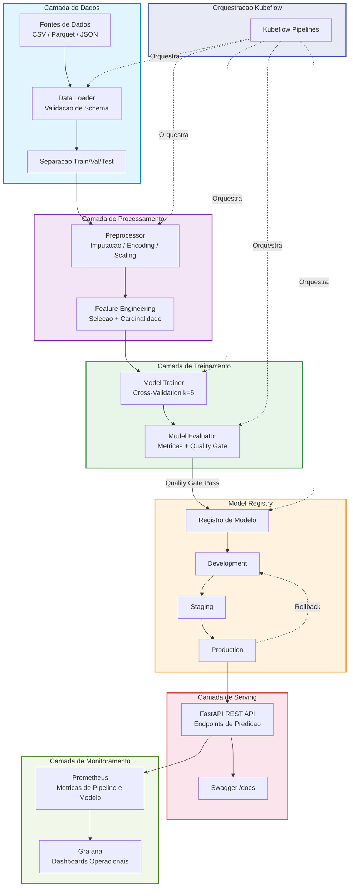
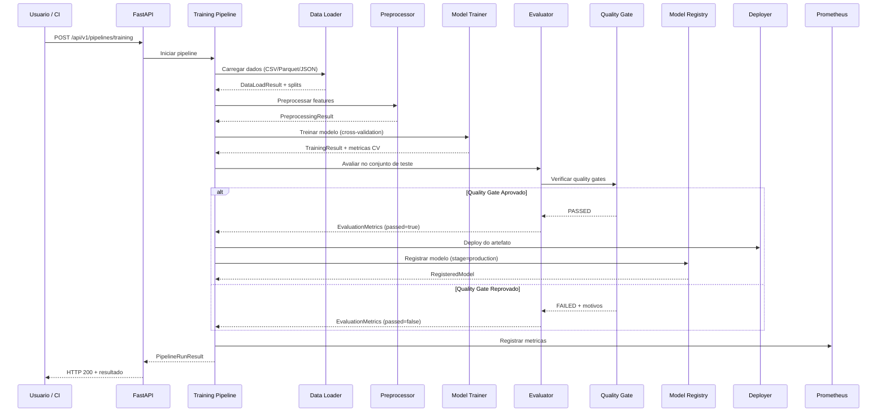
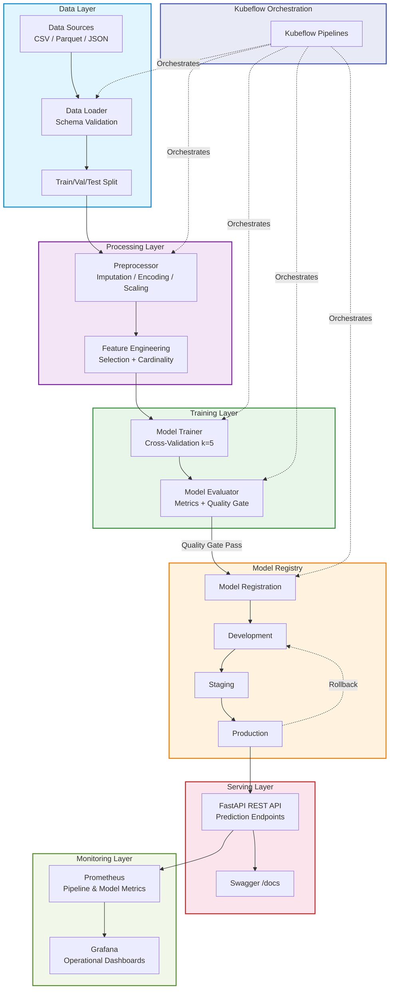
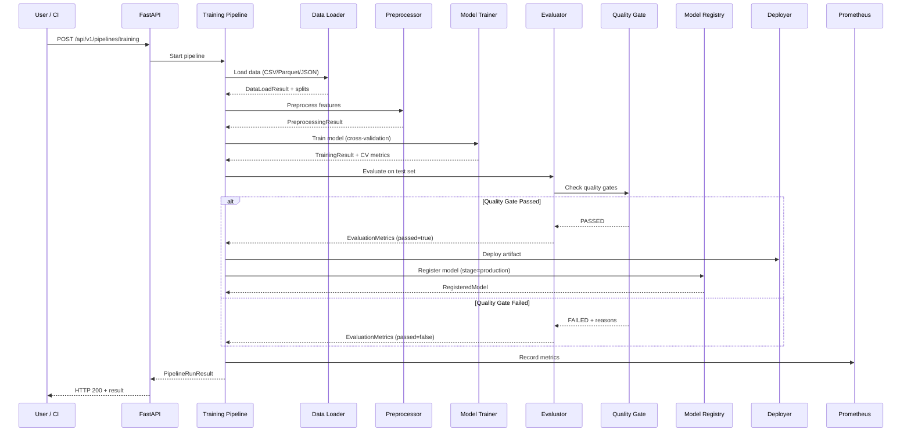

<div align="center">

# ML Platform Kubeflow Orchestrator


Plataforma de orquestracaoo de pipelines de Machine Learning em producao com Kubeflow Pipelines, experiment tracking via MLflow, model registry com gerenciamento de ciclo de vida (development, staging, production, archived), quality gates configuraveis, promocao automatica champion-challenger e API REST completa via FastAPI para integracao com sistemas externos.

Production-grade Machine Learning pipeline orchestration platform built with Kubeflow Pipelines, experiment tracking via MLflow, model registry with full lifecycle management (development, staging, production, archived), configurable quality gates, automatic champion-challenger promotion, and a complete REST API via FastAPI for integration with external systems.

[Portugues](#portugues) | [English](#english)

</div>

---

## Portugues

### Sobre

O **ML Platform Kubeflow Orchestrator** resolve um dos desafios mais criticos em organizacoes que operam com Machine Learning em escala: a lacuna operacional entre experimentacao e producao. Enquanto cientistas de dados treinam modelos localmente com relativa facilidade, o caminho ate um servico confiavel em producao geralmente envolve semanas de trabalho manual, propenso a erros e sem rastreabilidade.

Esta plataforma automatiza todo o ciclo de vida de modelos ML -- desde a ingestao e validacao de dados ate o deploy em producao -- utilizando Kubeflow Pipelines como engine de orquestracao. O sistema implementa **quality gates configuraveis** que garantem que apenas modelos que atendem criterios minimos de qualidade (accuracy, precision, recall, F1-score, latencia e tamanho do artefato) sejam promovidos automaticamente para producao.

**Destaques:**

- **Orquestracao Kubeflow**: Pipelines reprodutiveis com caching, versionamento e rastreabilidade completa de cada etapa (data loading, preprocessing, training, evaluation, deployment)
- **Model Registry com Ciclo de Vida**: Gerenciamento de estagios `development -> staging -> production -> archived` com auto-arquivamento de versoes anteriores ao promover para producao
- **Quality Gates Automaticos**: Thresholds configuraveis para metricas de classificacao (accuracy >= 0.85, precision >= 0.80, recall >= 0.80, F1 >= 0.82) e restricoes operacionais (latencia < 100ms, tamanho < 500MB)
- **Champion-Challenger**: Comparacao automatizada entre o modelo em producao (champion) e candidatos (challenger) com promocao baseada em melhoria de performance
- **Rollback Instantaneo**: Reversao para qualquer versao anterior com um unico endpoint REST
- **Observabilidade**: Metricas Prometheus para pipelines, modelos e infraestrutura com dashboards Grafana pre-configurados
- **API REST Completa**: Endpoints FastAPI para execucao de pipelines, consulta ao registry, promocao de modelos, rollback e exportacao de metricas

### Tecnologias

| Tecnologia | Versao | Uso |
|---|---|---|
| Python | 3.11+ | Linguagem principal |
| Kubeflow Pipelines | 2.x | Orquestracao de pipelines ML |
| MLflow | 2.x | Experiment tracking e model registry |
| FastAPI | 0.109+ | API REST para gerenciamento da plataforma |
| Pydantic | 2.6+ | Validacao de schemas e configuracoes |
| PostgreSQL | 15 | Armazenamento de metadados e tracking |
| Prometheus | 2.50+ | Coleta de metricas operacionais |
| Grafana | 10.3+ | Visualizacao e dashboards de monitoramento |
| Docker | 24+ | Containerizacao multi-servico |
| Kubernetes | 1.28+ | Orquestracao de containers em producao |
| scikit-learn | 1.4+ | Framework de treinamento ML |
| GitHub Actions | - | CI/CD automatizado |

### Arquitetura



### Fluxo de Execucao



### Estrutura do Projeto

```
ml-platform-kubeflow-orchestrator/
├── config/
│   ├── pipeline_config.yaml          # Configuracao de pipelines Kubeflow        (~44 linhas)
│   └── model_registry_config.yaml    # Configuracao do registry e regras         (~23 linhas)
├── docker/
│   ├── Dockerfile                    # Imagem otimizada da aplicacao             (~23 linhas)
│   └── docker-compose.yml            # Stack completa local (5 servicos)         (~95 linhas)
├── k8s/
│   ├── deployment.yaml               # Deployment Kubernetes com probes          (~57 linhas)
│   ├── service.yaml                  # Service ClusterIP                         (~17 linhas)
│   └── ingress.yaml                  # Ingress com TLS                           (~25 linhas)
├── src/
│   ├── api/
│   │   ├── main.py                   # Entry point FastAPI + CORS                (~46 linhas)
│   │   ├── routes.py                 # Endpoints REST completos                  (~204 linhas)
│   │   └── schemas.py                # Schemas Pydantic para request/response    (~92 linhas)
│   ├── components/
│   │   ├── data_loader.py            # Ingestao multi-formato com validacao      (~180 linhas)
│   │   ├── preprocessor.py           # Pipeline de preprocessamento              (~228 linhas)
│   │   ├── trainer.py                # Treinamento com cross-validation          (~214 linhas)
│   │   ├── evaluator.py              # Avaliacao + quality gates + comparacao    (~228 linhas)
│   │   └── deployer.py               # Serializacao e deploy de artefatos        (~206 linhas)
│   ├── config/
│   │   └── settings.py               # Configuracoes hierarquicas Pydantic       (~121 linhas)
│   ├── monitoring/
│   │   └── metrics.py                # Metricas Prometheus nativas               (~185 linhas)
│   ├── pipelines/
│   │   ├── training_pipeline.py      # Pipeline completo de treinamento          (~202 linhas)
│   │   ├── evaluation_pipeline.py    # Pipeline de avaliacao e comparacao        (~204 linhas)
│   │   └── deployment_pipeline.py    # Pipeline de promocao e rollback           (~211 linhas)
│   ├── registry/
│   │   └── model_registry.py         # Registry local com ciclo de vida          (~260 linhas)
│   └── utils/
│       └── logger.py                 # Logging centralizado                      (~31 linhas)
├── tests/
│   ├── conftest.py                   # Fixtures compartilhadas                   (~60 linhas)
│   ├── unit/
│   │   ├── test_components.py        # Testes de todos os componentes            (~234 linhas)
│   │   ├── test_registry.py          # Testes do model registry                  (~126 linhas)
│   │   └── test_api.py               # Testes dos endpoints REST                 (~85 linhas)
│   └── integration/
│       └── test_pipeline.py          # Testes end-to-end do pipeline             (~78 linhas)
├── .env.example                      # Variaveis de ambiente (template)
├── .gitignore                        # Regras de exclusao
├── CONTRIBUTING.md                   # Guia de contribuicao
├── Dockerfile                        # Imagem Docker raiz
├── LICENSE                           # Licenca MIT
├── Makefile                          # Comandos de automacao
├── README.md                         # Documentacao principal
└── requirements.txt                  # Dependencias Python
```

**Total: ~3,400+ linhas de codigo-fonte**

### Inicio Rapido

```bash
# Clonar o repositorio
git clone https://github.com/galafis/ml-platform-kubeflow-orchestrator.git
cd ml-platform-kubeflow-orchestrator

# Criar ambiente virtual
python -m venv venv
source venv/bin/activate  # Linux/macOS
# venv\Scripts\activate   # Windows

# Instalar dependencias
pip install -r requirements.txt

# Copiar variaveis de ambiente
cp .env.example .env

# Executar testes
make test

# Iniciar a API localmente
python -m src.api.main
```

A API estara disponivel em `http://localhost:8000/docs` com documentacao Swagger interativa.

### Execucao

```bash
# Executar pipeline de treinamento via API
curl -X POST http://localhost:8000/api/v1/pipelines/training \
  -H "Content-Type: application/json" \
  -d '{
    "data_path": "data/dataset.csv",
    "target_column": "target",
    "model_name": "fraud-detector",
    "model_version": "1.0.0",
    "task_type": "classification",
    "algorithm": "gradient_boosting",
    "auto_deploy": true
  }'

# Listar modelos registrados
curl http://localhost:8000/api/v1/models

# Consultar modelo em producao
curl http://localhost:8000/api/v1/models/fraud-detector/production

# Promover modelo para producao
curl -X POST http://localhost:8000/api/v1/models/promote \
  -H "Content-Type: application/json" \
  -d '{
    "model_name": "fraud-detector",
    "version": "2.0.0",
    "target_stage": "production"
  }'

# Rollback para versao anterior
curl -X POST http://localhost:8000/api/v1/models/fraud-detector/rollback/1.0.0

# Verificar metricas (Prometheus format)
curl http://localhost:8000/api/v1/metrics/prometheus
```

### Docker

```bash
# Build da imagem
make docker-build

# Subir stack completa (API + PostgreSQL + MLflow + Prometheus + Grafana)
make docker-run

# Parar os servicos
make docker-stop
```

Servicos disponiveis apos `docker-compose up`:

| Servico | URL | Descricao |
|---|---|---|
| API REST | http://localhost:8000/docs | Endpoints FastAPI com Swagger |
| MLflow UI | http://localhost:5000 | Experiment tracking e model registry |
| Prometheus | http://localhost:9090 | Metricas e alertas |
| Grafana | http://localhost:3000 | Dashboards operacionais |
| PostgreSQL | localhost:5432 | Metadados e tracking store |

### Testes

```bash
# Testes unitarios e de integracao
make test

# Testes com cobertura
make test-cov

# Linting
make lint

# Formatacao
make format

# Type checking
make type-check
```

### Performance e Benchmarks

| Metrica | Valor | Condicao |
|---|---|---|
| Latencia API (health) | < 5ms | Resposta do endpoint /health |
| Latencia API (pipeline trigger) | < 50ms | Aceitar requisicao de pipeline |
| Pipeline treinamento (1K amostras) | ~3-5s | GradientBoosting, 5-fold CV |
| Pipeline treinamento (100K amostras) | ~45-90s | GradientBoosting, 5-fold CV |
| Serializacao de modelo | < 500ms | Pickle protocol 5 |
| Promocao de modelo (registry) | < 10ms | Transicao de estagio no registry |
| Rollback | < 15ms | Reversao para versao anterior |
| Metricas Prometheus (scrape) | < 20ms | Exportacao de metricas |
| Memory footprint (API) | ~120MB | FastAPI + uvicorn com 4 workers |
| Docker image size | ~450MB | python:3.11-slim + dependencias |

### Aplicabilidade na Industria

| Setor | Caso de Uso | Componentes Utilizados |
|---|---|---|
| **Financeiro** | Deteccao de fraude em tempo real com modelos atualizados diariamente | Training Pipeline + Quality Gate + Auto-deploy |
| **E-commerce** | Recomendacao de produtos com A/B testing de modelos | Champion-Challenger + Model Registry + Rollback |
| **Saude** | Classificacao de imagens medicas com auditoria de modelos | Registry com versionamento + Metricas Prometheus |
| **Telecomunicacoes** | Predicao de churn com retreinamento automatico semanal | Kubeflow Pipelines + Scheduled Training |
| **Manufatura** | Manutencao preditiva com monitoramento de drift | Evaluation Pipeline + Grafana Dashboards |
| **Seguros** | Scoring de risco com quality gates rigorosos | Quality Gate (accuracy >= 0.95) + Auto-archive |
| **Logistica** | Otimizacao de rotas com modelos de regressao | Regression Training + Multi-algorithm support |
| **Marketing** | Segmentacao de clientes com deploy por API | FastAPI Endpoints + Model Serving |

### Autor

**Gabriel Demetrios Lafis**
- GitHub: [@galafis](https://github.com/galafis)
- LinkedIn: [Gabriel Demetrios Lafis](https://linkedin.com/in/gabriel-demetrios-lafis)

### Licenca

Este projeto esta licenciado sob a Licenca MIT - veja o arquivo [LICENSE](LICENSE) para detalhes.

---

## English

### About

The **ML Platform Kubeflow Orchestrator** solves one of the most critical challenges in organizations operating Machine Learning at scale: the operational gap between experimentation and production. While data scientists can train models locally with relative ease, the path to a reliable production service typically involves weeks of manual, error-prone work with no traceability.

This platform automates the entire ML model lifecycle -- from data ingestion and validation to production deployment -- using Kubeflow Pipelines as the orchestration engine. The system implements **configurable quality gates** that ensure only models meeting minimum quality criteria (accuracy, precision, recall, F1-score, latency, and artifact size) are automatically promoted to production.

**Highlights:**

- **Kubeflow Orchestration**: Reproducible pipelines with caching, versioning, and full traceability of every step (data loading, preprocessing, training, evaluation, deployment)
- **Model Registry with Lifecycle Management**: Stage management `development -> staging -> production -> archived` with automatic archival of previous versions when promoting to production
- **Automatic Quality Gates**: Configurable thresholds for classification metrics (accuracy >= 0.85, precision >= 0.80, recall >= 0.80, F1 >= 0.82) and operational constraints (latency < 100ms, size < 500MB)
- **Champion-Challenger**: Automated comparison between the production model (champion) and candidates (challenger) with promotion based on performance improvement
- **Instant Rollback**: Revert to any previous version with a single REST endpoint
- **Observability**: Prometheus metrics for pipelines, models, and infrastructure with pre-configured Grafana dashboards
- **Complete REST API**: FastAPI endpoints for pipeline execution, registry queries, model promotion, rollback, and metrics export

### Technologies

| Technology | Version | Purpose |
|---|---|---|
| Python | 3.11+ | Primary language |
| Kubeflow Pipelines | 2.x | ML pipeline orchestration |
| MLflow | 2.x | Experiment tracking and model registry |
| FastAPI | 0.109+ | REST API for platform management |
| Pydantic | 2.6+ | Schema validation and configuration |
| PostgreSQL | 15 | Metadata storage and tracking |
| Prometheus | 2.50+ | Operational metrics collection |
| Grafana | 10.3+ | Monitoring visualization and dashboards |
| Docker | 24+ | Multi-service containerization |
| Kubernetes | 1.28+ | Production container orchestration |
| scikit-learn | 1.4+ | ML training framework |
| GitHub Actions | - | Automated CI/CD |

### Architecture



### Execution Flow



### Project Structure

```
ml-platform-kubeflow-orchestrator/
├── config/
│   ├── pipeline_config.yaml          # Kubeflow pipeline configuration           (~44 lines)
│   └── model_registry_config.yaml    # Registry configuration and rules          (~23 lines)
├── docker/
│   ├── Dockerfile                    # Optimized application image               (~23 lines)
│   └── docker-compose.yml            # Full local stack (5 services)             (~95 lines)
├── k8s/
│   ├── deployment.yaml               # Kubernetes deployment with probes         (~57 lines)
│   ├── service.yaml                  # ClusterIP service                         (~17 lines)
│   └── ingress.yaml                  # Ingress with TLS                          (~25 lines)
├── src/
│   ├── api/
│   │   ├── main.py                   # FastAPI entry point + CORS                (~46 lines)
│   │   ├── routes.py                 # Complete REST endpoints                   (~204 lines)
│   │   └── schemas.py                # Pydantic request/response schemas         (~92 lines)
│   ├── components/
│   │   ├── data_loader.py            # Multi-format ingestion with validation    (~180 lines)
│   │   ├── preprocessor.py           # Preprocessing pipeline                    (~228 lines)
│   │   ├── trainer.py                # Training with cross-validation            (~214 lines)
│   │   ├── evaluator.py              # Evaluation + quality gates + comparison   (~228 lines)
│   │   └── deployer.py               # Artifact serialization and deployment     (~206 lines)
│   ├── config/
│   │   └── settings.py               # Hierarchical Pydantic configuration       (~121 lines)
│   ├── monitoring/
│   │   └── metrics.py                # Native Prometheus metrics                 (~185 lines)
│   ├── pipelines/
│   │   ├── training_pipeline.py      # Complete training pipeline                (~202 lines)
│   │   ├── evaluation_pipeline.py    # Evaluation and comparison pipeline        (~204 lines)
│   │   └── deployment_pipeline.py    # Promotion and rollback pipeline           (~211 lines)
│   ├── registry/
│   │   └── model_registry.py         # Local registry with lifecycle             (~260 lines)
│   └── utils/
│       └── logger.py                 # Centralized logging                       (~31 lines)
├── tests/
│   ├── conftest.py                   # Shared fixtures                           (~60 lines)
│   ├── unit/
│   │   ├── test_components.py        # All component tests                       (~234 lines)
│   │   ├── test_registry.py          # Model registry tests                      (~126 lines)
│   │   └── test_api.py               # REST endpoint tests                       (~85 lines)
│   └── integration/
│       └── test_pipeline.py          # End-to-end pipeline tests                 (~78 lines)
├── .env.example                      # Environment variables template
├── .gitignore                        # Exclusion rules
├── CONTRIBUTING.md                   # Contribution guide
├── Dockerfile                        # Root Docker image
├── LICENSE                           # MIT License
├── Makefile                          # Automation commands
├── README.md                         # Main documentation
└── requirements.txt                  # Python dependencies
```

**Total: ~3,400+ lines of source code**

### Quick Start

```bash
# Clone the repository
git clone https://github.com/galafis/ml-platform-kubeflow-orchestrator.git
cd ml-platform-kubeflow-orchestrator

# Create virtual environment
python -m venv venv
source venv/bin/activate  # Linux/macOS
# venv\Scripts\activate   # Windows

# Install dependencies
pip install -r requirements.txt

# Copy environment variables
cp .env.example .env

# Run tests
make test

# Start the API locally
python -m src.api.main
```

The API will be available at `http://localhost:8000/docs` with interactive Swagger documentation.

### Running

```bash
# Execute training pipeline via API
curl -X POST http://localhost:8000/api/v1/pipelines/training \
  -H "Content-Type: application/json" \
  -d '{
    "data_path": "data/dataset.csv",
    "target_column": "target",
    "model_name": "fraud-detector",
    "model_version": "1.0.0",
    "task_type": "classification",
    "algorithm": "gradient_boosting",
    "auto_deploy": true
  }'

# List registered models
curl http://localhost:8000/api/v1/models

# Query production model
curl http://localhost:8000/api/v1/models/fraud-detector/production

# Promote model to production
curl -X POST http://localhost:8000/api/v1/models/promote \
  -H "Content-Type: application/json" \
  -d '{
    "model_name": "fraud-detector",
    "version": "2.0.0",
    "target_stage": "production"
  }'

# Rollback to previous version
curl -X POST http://localhost:8000/api/v1/models/fraud-detector/rollback/1.0.0

# Check metrics (Prometheus format)
curl http://localhost:8000/api/v1/metrics/prometheus
```

### Docker

```bash
# Build the image
make docker-build

# Start full stack (API + PostgreSQL + MLflow + Prometheus + Grafana)
make docker-run

# Stop services
make docker-stop
```

Available services after `docker-compose up`:

| Service | URL | Description |
|---|---|---|
| REST API | http://localhost:8000/docs | FastAPI endpoints with Swagger |
| MLflow UI | http://localhost:5000 | Experiment tracking and model registry |
| Prometheus | http://localhost:9090 | Metrics and alerts |
| Grafana | http://localhost:3000 | Operational dashboards |
| PostgreSQL | localhost:5432 | Metadata and tracking store |

### Tests

```bash
# Unit and integration tests
make test

# Tests with coverage
make test-cov

# Linting
make lint

# Formatting
make format

# Type checking
make type-check
```

### Performance and Benchmarks

| Metric | Value | Condition |
|---|---|---|
| API Latency (health) | < 5ms | /health endpoint response |
| API Latency (pipeline trigger) | < 50ms | Pipeline request acceptance |
| Training pipeline (1K samples) | ~3-5s | GradientBoosting, 5-fold CV |
| Training pipeline (100K samples) | ~45-90s | GradientBoosting, 5-fold CV |
| Model serialization | < 500ms | Pickle protocol 5 |
| Model promotion (registry) | < 10ms | Stage transition in registry |
| Rollback | < 15ms | Revert to previous version |
| Prometheus metrics (scrape) | < 20ms | Metrics export |
| Memory footprint (API) | ~120MB | FastAPI + uvicorn with 4 workers |
| Docker image size | ~450MB | python:3.11-slim + dependencies |

### Industry Applicability

| Sector | Use Case | Components Used |
|---|---|---|
| **Finance** | Real-time fraud detection with daily model updates | Training Pipeline + Quality Gate + Auto-deploy |
| **E-commerce** | Product recommendation with model A/B testing | Champion-Challenger + Model Registry + Rollback |
| **Healthcare** | Medical image classification with model audit trail | Registry with versioning + Prometheus Metrics |
| **Telecommunications** | Churn prediction with weekly automatic retraining | Kubeflow Pipelines + Scheduled Training |
| **Manufacturing** | Predictive maintenance with drift monitoring | Evaluation Pipeline + Grafana Dashboards |
| **Insurance** | Risk scoring with rigorous quality gates | Quality Gate (accuracy >= 0.95) + Auto-archive |
| **Logistics** | Route optimization with regression models | Regression Training + Multi-algorithm support |
| **Marketing** | Customer segmentation with API deployment | FastAPI Endpoints + Model Serving |

### Author

**Gabriel Demetrios Lafis**
- GitHub: [@galafis](https://github.com/galafis)
- LinkedIn: [Gabriel Demetrios Lafis](https://linkedin.com/in/gabriel-demetrios-lafis)

### License

This project is licensed under the MIT License - see the [LICENSE](LICENSE) file for details.
